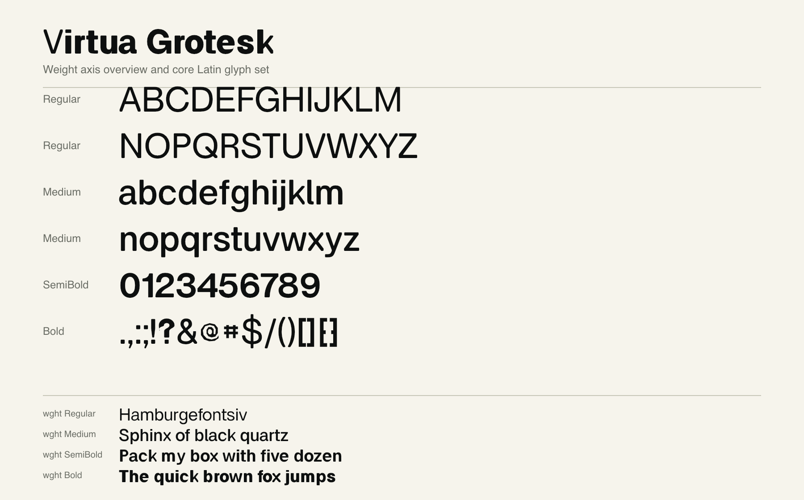
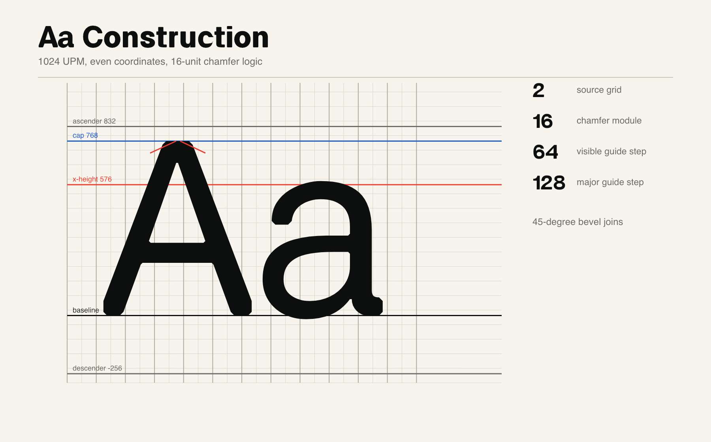
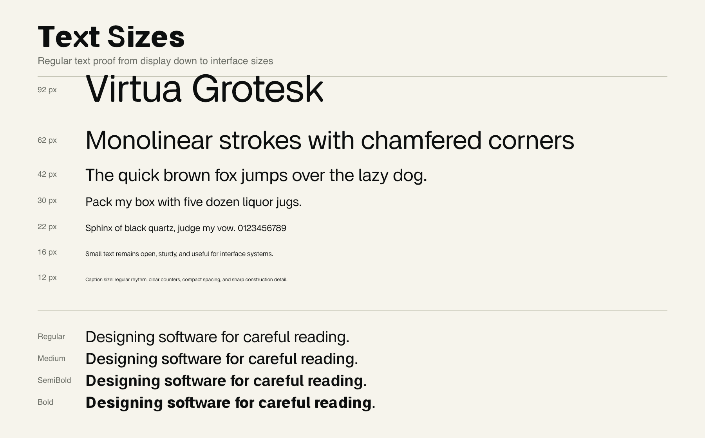

# Virtua Grotesk

Virtua Grotesk is an open-source variable geometric grotesk with a Weight axis
from Regular to Bold. The design uses monolinear strokes and chamfered corners
as a defining construction detail.







## About

Virtua Grotesk is designed for interfaces, editorial systems, and display
typography that need a sturdy grotesk voice with a visible construction logic.
Its sharp junctions use consistent 45-degree bevels, while round forms keep
smooth curves and generous counters. The family is being prepared with Latin
and Arabic support for Google Fonts onboarding.

The variable font currently exposes a single `wght` axis from 400 to 700, with
static Regular, Medium, SemiBold, and Bold instances generated from the same
sources.

## Building

This project keeps UFO sources in `sources/` and builds fonts from
`sources/VirtuaGrotesk.designspace`.

### Prerequisites

Create a Python virtual environment and install the build tools:

```bash
python3 -m venv .venv
source .venv/bin/activate
pip install -r requirements.txt
```

`requirements.in` records the direct Python dependencies. `requirements.txt` is
the pinned install snapshot for the current onboarding toolchain; see
`documentation/python-tooling-notes.md` before updating it.

Install [Fontspector](https://github.com/fonttools/fontspector) separately for
Google Fonts QA. The current GF QA guide says FontBakery was previously the
primary testing tool and that Google Fonts now uses Fontspector; run the
`googlefonts` profile for onboarding checks. Some Google Fonts upstream/template
docs still mention FontBakery-era automation, so treat Fontspector as this
repo's QA entrypoint and only use FontBakery if a Google Fonts reviewer asks
for a specific legacy check. The local QA scripts use the normal
`~/.fontspector` directory and still pass `--skip-network` for repeatable local
checks.

### Build Instructions

To build the fonts, run the build script:

```bash
./build.sh
```

The same build can be run through Make:

```bash
make build
```

To list the available workflow targets:

```bash
make help
```

The normal local workflow is intentionally small:

| Command | Purpose |
| --- | --- |
| `make setup` | Create `.venv` and install `requirements.txt`. |
| `make build` | Build variable and static TTFs into `fonts/`. |
| `make proof` | Render the main DrawBot-skia PDF proof. |
| `make specimen` | Render the landscape print spacing specimen PDF. |
| `make readme-images` | Render the DrawBot-skia README PNG specimens. |
| `make qa` / `make test` | Run Fontspector's Google Fonts profile. |
| `make reports` | Regenerate generated readiness/review reports. |
| `make preflight` | Build, proof, specimen, reports, then check expected artifacts. |
| `make drawing-check` | Refresh drawing-session reports while editing sources. |
| `make release-check` | Refresh source/release blocker reports. |
| `make package-check` | Refresh downstream package readiness reports. |

Use `GFT_PACKAGER_SOURCE_MODE=latest-release make package-check` or
`GFT_PACKAGER_SOURCE_MODE=build-from-source make package-check` when comparing
Google Fonts Packager source strategies.

The canonical human/agent QA checklist is
`documentation/core-qa-process.md`. Generated readiness reports live under
`documentation/google-fonts/`; when in doubt, start with
`documentation/google-fonts/final-submission-blockers.md` and
`documentation/google-fonts/next-actions.md`.

`build.sh` is a small wrapper around `gftools builder sources/config.yaml`.
It cleans stale outputs, builds variable and static TTFs into `fonts/`, then
runs `scripts/fix_gf_metadata.py` on the generated fonts.

Note: The `fonts/` directory is excluded from version control to keep the repository size down.

## Proofs And Specimens

Proof PDFs use the project virtualenv plus `drawbot-skia`. If you want to run
proofs directly from a local checkout of the `eliheuer/drawbot-skia` fork, set
`DRAWBOT_SKIA_REPO` in the environment or in an ignored `local.mk` copied from
`local.mk.example`.

```bash
./.venv/bin/python
```

When `DRAWBOT_SKIA_REPO` is set, the Makefile prepends
`$DRAWBOT_SKIA_REPO/src` to `PYTHONPATH` for proof generation.
Run `make proof` for the main proof and `make specimen` for the landscape
spacing specimen. Both outputs are written to `documentation/proofs/`.
Run `make readme-images` to regenerate the README PNG specimens in
`documentation/assets/readme/`.

## Google Fonts Readiness

See `documentation/google-fonts/google-fonts-readiness.md` for the current onboarding
checklist, open decisions, and known engineering blockers. The final downstream
packaging checklist is in
`documentation/google-fonts/google-fonts-package-checklist.md`. The shortest place to answer
remaining policy and metadata decisions is
`documentation/google-fonts/google-fonts-decision-questions.md`.

If pausing for hand cleanup or drawing work, use
`documentation/manual-cleanup-handoff.md` as the checkpoint before resuming the
final package sequence.

Reusable Google Fonts onboarding knowledge from this pass is captured in
`.agents/` so it can be copied into future font repos:

- `.agents/google-fonts-onboarding-checklists.md`
- `.agents/google-fonts-official-reference-map.md`
- `.agents/skills/google-fonts-onboarding/SKILL.md`
- `.agents/skills/google-fonts-qa/SKILL.md`
- `.agents/skills/google-fonts-packaging/SKILL.md`
- `.agents/skills/google-fonts-nonlatin-drawing/SKILL.md`

To run the current local Google Fonts QA target:

```bash
./scripts/check_gf_fonts.sh
```

or:

```bash
make test
```

This target currently fails until the documented glyph coverage and contour
blockers are fixed. It checks the generated variable font and static TTFs, and
excludes the downstream-only repository directory-name check because this
upstream repo is not laid out as `ofl/virtuagrotesk`.

To regenerate the generated readiness and review reports after drawing work:

```bash
make reports
```

The Makefile uses `PYTHON ?= ./.venv/bin/python`, so another interpreter can be
used with `make reports PYTHON=/path/to/python`.

For focused checks while preparing a release:

```bash
make drawing-check
make release-check
make package-check
```

Run the full local handoff gate when you need the current build, proofs,
reports, and artifact check together:

```bash
make preflight
```

This builds the fonts, writes the main proof and spacing specimen, regenerates
reports with proof artifact evidence, then runs the local gate.

To refresh the local Google Fonts package readiness reports with the selected
release/archive source mode:

```bash
GFT_PACKAGER_SOURCE_MODE=latest-release make package-check
```

Review `documentation/google-fonts/package-dry-run-readiness.md` first. It
checks the local `google/fonts` fork, source mode, required inputs, downstream
placeholder state, and GitHub API credentials.
For a broader local command snapshot, review
`documentation/google-fonts/local-workflow-readiness.md`.

The checkout path is not hardcoded; set it with
`GF_REPO_PATH=/path/to/google/fonts` or in ignored `local.mk`. If Google Fonts
review asks for the fallback source-rebuild path, pass the matching Packager
mode explicitly:

```bash
GFT_PACKAGER_SOURCE_MODE=build-from-source make package-check
```

To regenerate the proof PDF:

```bash
make proof
make specimen
```

## Changelog

Notable release entries should be added here when a public upstream tag is
created.

**Unreleased. Version 1.000**

- Prepared the UFO/designspace source tree for Google Fonts-style builds with
  `gftools builder sources/config.yaml`.
- Added local Fontspector, metadata, glyphset, Arabic shaping, Arabic mark,
  consolidated Arabic review, and master-compatibility reports for onboarding
  review.
- Set the 600 static instance name to `SemiBold`.
- Recorded Arabic as first-submission scope, with `GF_Arabic_Core` as the
  minimum Arabic coverage target.
- Added a generated PUA/private-use scope report for Google Fonts subsetting
  review.

## Credits

Copyright author:

- Eli Heuer

Contributors:

- Eli Heuer

See `AUTHORS.txt` and `CONTRIBUTORS.txt` for the authoritative project-credit
files used for Google Fonts review.

## License

This Font Software is licensed under the SIL Open Font License, Version 1.1.
The license is available in `OFL.txt` and with a FAQ at
https://openfontlicense.org.
