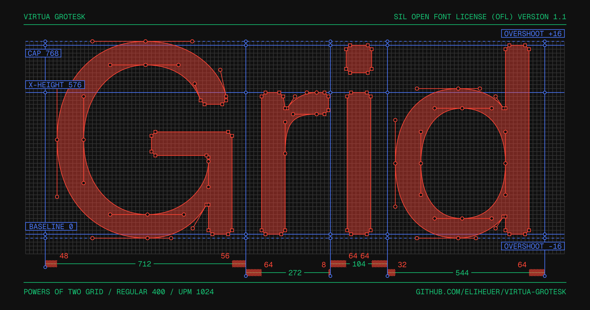

# Virtua Grotesk

Virtua Grotesk is an open-source variable geometric grotesk designed on a
powers-of-two grid. It runs from Regular (400) to Bold (700) on a single Weight
axis, with monolinear strokes and chamfered corners as its defining
construction detail.



**Read the story:** [Virtua Grotesk: Grid System as Dataset](https://elih.net/blog/virtua-grotesk),
on how the typeface is designed and the small neural network learning to draw it.

## About

Virtua Grotesk is drawn against powers of two rather than the usual decimal
grid. The em square is 1024 (2¹⁰), the vertical metrics are power-of-two sums,
and every coordinate lands on a strict 2-unit grid. That discipline gives the
family its sharp, systematic voice, and it also makes the source files
unusually clean training data: a small neural network is learning to draw the
typeface from its own grid-native outlines. The
[accompanying essay](https://elih.net/blog/virtua-grotesk) covers both the
typeface and the model, and why they are the same idea.

The design targets interfaces, editorial systems, and display typography that
want a sturdy grotesk voice with a visible construction logic. Sharp junctions
use consistent 45-degree bevels; round forms keep smooth curves and generous
counters. The family is being prepared with Latin and Arabic support for Google
Fonts.

## Design System

The load-bearing numbers (the full spec lives in [`DESIGN.md`](DESIGN.md)):

| Measurement | Value | Note |
| --- | --- | --- |
| UPM | 1024 | 2^10 |
| Drawing grid | 2 units | even coordinates preferred |
| Structural grid | 8 units | where most points land |
| Cap height | 768 | 512 + 256 |
| x-height | 576 | 512 + 64 |
| Descender | −256 | −2^8 |
| Chamfers | 16 units | the signature corner cut |
| Weight axis | 400–700 | Regular to Bold |

The grid is hierarchical: structure lands on an 8-unit lattice, and dropping to
the 2-unit lattice marks a deliberate optical correction. Static Regular,
Medium, SemiBold, and Bold instances are generated from the same variable
sources.

## Building

This project keeps UFO sources in `sources/` and builds fonts from
`sources/VirtuaGrotesk.designspace`.

### Prerequisites

Create a Python virtual environment and install the build tools:

```bash
python3 -m venv .venv
source .venv/bin/activate
pip install -r requirements.txt
```

`requirements.in` records the direct Python dependencies. `requirements.txt` is
the pinned install snapshot for the current onboarding toolchain; see
`documentation/python-tooling-notes.md` before updating it.

Install [Fontspector](https://github.com/fonttools/fontspector) separately for
Google Fonts QA. The current GF QA guide says FontBakery was previously the
primary testing tool and that Google Fonts now uses Fontspector; run the
`googlefonts` profile for onboarding checks. Some Google Fonts upstream/template
docs still mention FontBakery-era automation, so treat Fontspector as this
repo's QA entrypoint and only use FontBakery if a Google Fonts reviewer asks
for a specific legacy check. The local QA scripts use the normal
`~/.fontspector` directory and still pass `--skip-network` for repeatable local
checks.

### Build Instructions

To build the fonts, run the build script:

```bash
./build.sh
```

The same build can be run through Make:

```bash
make build
```

To list the available workflow targets:

```bash
make help
```

The normal local workflow is intentionally small:

| Command | Purpose |
| --- | --- |
| `make setup` | Create `.venv` and install `requirements.txt`. |
| `make build` | Build variable and static TTFs into `fonts/`. |
| `make proof` | Render the main DrawBot-skia PDF proof. |
| `make specimen` | Render the landscape print spacing specimen PDF. |
| `make readme-images` | Render the DrawBot-skia README PNG specimens. |
| `make qa` / `make test` | Run Fontspector's Google Fonts profile. |
| `make reports` | Regenerate source/build metadata reports. |
| `make preflight` | Build, proof, specimen, reports, then check expected artifacts. |

The canonical human/agent QA checklist is
`documentation/core-qa-process.md`. The active generated reports live under
`documentation/source/` and cover UFO metadata, generated font metadata, and
master compatibility. Older agent-generated report machinery is archived under
`documentation/archive/agent-generated-scripts/`.

`build.sh` is a small wrapper around `gftools builder sources/config.yaml`.
It cleans stale outputs, builds variable and static TTFs into `fonts/`, then
runs `scripts/fix_gf_metadata.py` on the generated fonts.

Note: The `fonts/` directory is excluded from version control to keep the repository size down.

## Proofs And Specimens

Proof PDFs use the project virtualenv plus `drawbot-skia`. If you want to run
proofs directly from a local checkout of the `eliheuer/drawbot-skia` fork, set
`DRAWBOT_SKIA_REPO` in the environment or in an ignored `local.mk` copied from
`local.mk.example`.

```bash
./.venv/bin/python
```

When `DRAWBOT_SKIA_REPO` is set, the Makefile prepends
`$DRAWBOT_SKIA_REPO/src` to `PYTHONPATH` for proof generation.
Run `make proof` for the main proof and `make specimen` for the landscape
spacing specimen. Both outputs are written to `documentation/proofs/`.
Run `make readme-images` to regenerate the README PNG specimens in
`documentation/assets/readme/`.

## Google Fonts Readiness

See `documentation/google-fonts/README.md` for the current curated Google Fonts
notes and active submission text files. Older generated readiness reports were
archived under `documentation/archive/agent-generated-reports/google-fonts/`.

If pausing for hand cleanup or drawing work, use
`documentation/manual-cleanup-handoff.md` as the checkpoint before resuming the
build, proof, and QA sequence.

Reusable Google Fonts onboarding knowledge from this pass is captured in
`.agents/` so it can be copied into future font repos:

- `GOOGLE_FONTS_PORTING_CHECKLIST.md`
- `.agents/google-fonts-onboarding-checklists.md`
- `.agents/google-fonts-official-reference-map.md`
- `.agents/skills/google-fonts-onboarding/SKILL.md`
- `.agents/skills/google-fonts-qa/SKILL.md`
- `.agents/skills/google-fonts-packaging/SKILL.md`
- `.agents/skills/google-fonts-nonlatin-drawing/SKILL.md`

To run the current local Google Fonts QA target:

```bash
./scripts/check_gf_fonts.sh
```

or:

```bash
make test
```

This target currently fails until the documented glyph coverage and contour
blockers are fixed. It checks the generated variable font and static TTFs, and
excludes the downstream-only repository directory-name check because this
upstream repo is not laid out as `ofl/virtuagrotesk`.

To regenerate the active source/build metadata reports after drawing work:

```bash
make reports
```

The Makefile uses `PYTHON ?= ./.venv/bin/python`, so another interpreter can be
used with `make reports PYTHON=/path/to/python`.

Run the full local handoff gate when you need the current build, proofs,
reports, and artifact check together:

```bash
make preflight
```

This builds the fonts, writes the main proof and spacing specimen, regenerates
the active reports, then runs the local gate.

To regenerate the proof PDF:

```bash
make proof
make specimen
```

## Changelog

Notable release entries should be added here when a public upstream tag is
created.

**Unreleased. Version 1.000**

- Prepared the UFO/designspace source tree for Google Fonts-style builds with
  `gftools builder sources/config.yaml`.
- Added local Fontspector, metadata, proof/specimen, README image, and
  master-compatibility workflows for onboarding
  review.
- Set the 600 static instance name to `SemiBold`.
- Recorded Arabic as first-submission scope, with `GF_Arabic_Core` as the
  minimum Arabic coverage target.
- Added a generated PUA/private-use scope report for Google Fonts subsetting
  review.

## Credits

Copyright author:

- Eli Heuer

Contributors:

- Eli Heuer

See `AUTHORS.txt` and `CONTRIBUTORS.txt` for the authoritative project-credit
files used for Google Fonts review.

## License

This Font Software is licensed under the SIL Open Font License, Version 1.1.
The license is available in `OFL.txt` and with a FAQ at
https://openfontlicense.org.
