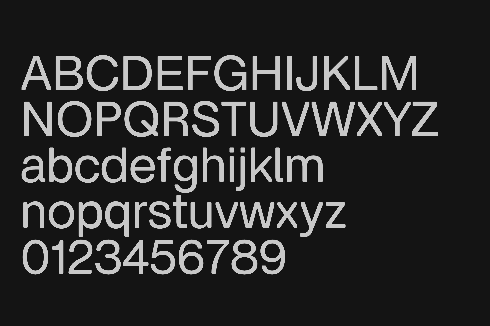

# Virtua Grotesk

Virtua Grotesk is an open-source variable geometric grotesk with a Weight axis
from Regular to Bold. The design uses monolinear strokes and chamfered corners
as a defining construction detail.



## About

Virtua Grotesk is designed for interfaces, editorial systems, and display
typography that need a sturdy grotesk voice with a visible construction logic.
Its sharp junctions use consistent 45-degree bevels, while round forms keep
smooth curves and generous counters. The family is being prepared with Latin
and Arabic support for Google Fonts onboarding.

The variable font currently exposes a single `wght` axis from 400 to 700, with
static Regular, Medium, SemiBold, and Bold instances generated from the same
sources.

## Building

This project keeps UFO sources in `sources/` and builds fonts from
`sources/VirtuaGrotesk.designspace`.

### Prerequisites

Create a Python virtual environment and install the build tools:

```bash
python3 -m venv venv
source venv/bin/activate
pip install -r requirements.txt
```

`requirements.in` records the direct Python dependencies. `requirements.txt` is
the pinned install snapshot for the current onboarding toolchain; see
`documentation/python-tooling-notes.md` before updating it.

Install [Fontspector](https://github.com/fonttools/fontspector) separately for
Google Fonts QA. The current GF QA guide says FontBakery was previously the
primary testing tool and that Google Fonts now uses Fontspector; run the
`googlefonts` profile for onboarding checks. Some Google Fonts upstream/template
docs still mention FontBakery-era automation, so treat Fontspector as this
repo's QA entrypoint and only use FontBakery if a Google Fonts reviewer asks
for a specific legacy check. The local QA scripts use the normal
`~/.fontspector` directory and still pass `--skip-network` for repeatable local
checks.

The fallback build can also use [fontc](https://github.com/googlefonts/fontc)
for fast local variable-font builds:

```bash
cargo install fontc
```

### Build Instructions

To build the fonts, run the build script:

```bash
./build.sh
```

The same build can be run through Make:

```bash
make build
```

To list the available workflow targets:

```bash
make help
```

To review the remaining Google Fonts policy and metadata decisions:

```bash
make decisions
```

This prints the generated priority-sorted maintainer answer sheet at
`documentation/google-fonts-decision-answer-sheet.md`. The canonical long-form
question list remains `documentation/google-fonts-decision-questions.md`, and
accepted answers should be recorded in
`documentation/google-fonts-decisions.md` before source or package metadata is
changed.

To regenerate the answer sheet and inspect whether the open questions are wired
to the right downstream files and helper commands:

```bash
make decision-readiness-check
```

To inspect the current final-submission blocker summary:

```bash
make blockers
```

To regenerate and inspect the current Google Fonts Add Font issue draft:

```bash
make issue-draft
```

To review the public source, release tag, and Packager source-mode readiness:

```bash
make source-strategy-check
```

To review the release/archive manifest that will feed the selected
`latest-release` Packager path:

```bash
make release-archive-check
```

To build the deterministic local review zip that mirrors the planned GitHub
release asset:

```bash
make release-archive-build
```

To verify the current local review zip without rebuilding it, including stable
ZIP metadata:

```bash
make release-archive-verify
```

To test the release/archive path-safety guards:

```bash
make release-archive-test
```

To review the GitHub release command draft and generated release notes for the
selected release/archive source path:

```bash
make release-draft-check
```

To review the full packaging and downstream PR stack without opening a PR:

```bash
make package-readiness-check
```

Use the same source-mode environment variable here that you plan to use for
the no-PR Packager pass:

```bash
GFT_PACKAGER_SOURCE_MODE=latest-release make package-readiness-check
GFT_PACKAGER_SOURCE_MODE=build-from-source make package-readiness-check
```

To compare recent merged Google Fonts packages and their upstream repos against
the current Virtua Grotesk repo shape:

```bash
make recent-gf-check
```

To review which official Google Fonts docs and Google Fonts GitHub references
support each local readiness report:

```bash
make reference-index-check
```

To review family-name, namecheck, Reserved Font Name, and Google CLA readiness:

```bash
make family-name-check
```

To review authorship, contact-line, and AI-disclosure readiness:

```bash
make authorship-check
```

To review decision-linked warning buckets before deciding whether to fix or
defer them:

```bash
make vendor-id-check
make kerning-check
make kerning-proof-check
make kerning-proof-review-check
make pua-scope-check
make avar-check
make warnings-check
make metadata-warning-check
make zero-warning-check
```

`make warnings-check` now includes the package-context warning floor from the
intended downstream `METADATA.pb` preview. Use `make metadata-warning-check`
and `make zero-warning-check` when deciding whether a lower warning count is a
real fix or just a narrower serving scope.

The canonical human/agent QA checklist is
`documentation/core-qa-process.md`. It ties together Fontspector, Google Fonts
`gftools qa --proof` visual review, the generated
`documentation/kerning-proof-review.md` review packet, DrawBot proofing,
generated readiness reports, and Packager dry-run gates.

`make kerning-proof-check` runs the Google Fonts `gftools qa --proof`
HTML proof used for visual spacing and kerning review. It needs the
`gftools` QA extras installed in the local venv.

Treat this as a core QA step, not an optional artifact generator. Review the
HTML proof in `documentation/gftools-qa/` and the generated
`documentation/kerning-proof-review.md` checklist before considering kerning,
spacing, or a kerning deferral final for Google Fonts handoff.

To check whether local GitHub API credentials are ready for Packager:

```bash
make github-auth-check
```

To review Google Fonts designer-profile readiness for the current
`AUTHORS.txt` and downstream `METADATA.pb` designer string:

```bash
make designer-profile-check
```

To validate a candidate Google Fonts designer-profile `info.pb` before
committing a profile PR:

```bash
make designer-profile-info-check INFO=path/to/info.pb
```

To validate a candidate square Google Fonts designer-profile image before
running `gftools add-designer`:

```bash
make designer-profile-image-check IMAGE=path/to/eliheuer.png
```

To validate a candidate Google Fonts designer-profile biography snippet:

```bash
make designer-profile-bio-check BIO=path/to/bio.html
```

To test the designer-profile validators without touching `google/fonts`:

```bash
make designer-profile-validator-test
```

To dry-run the final designer-profile install into the local `google/fonts`
fork after the profile link, biography, and image are approved:

```bash
make designer-profile-prepare-check
```

To preview the public upstream URL replacement set without editing files:

```bash
make public-upstream-url-check
```

The canonical public URL is `https://github.com/eliheuer/virtua-grotesk`.
If new placeholder surfaces are added later, apply the decided URL explicitly with:

```bash
./venv/bin/python scripts/apply_public_upstream_url.py --url https://github.com/eliheuer/virtua-grotesk --apply
```

When `gftools` is installed, `build.sh` uses `gftools builder sources/config.yaml`.
If `gftools` is not available, it falls back to the local `fontc` + `fontmake`
workflow. The compiled fonts are written to `fonts/`.

Note: The `fonts/` directory is excluded from version control to keep the repository size down.

## Rendering Specimens

This project uses [DesignBot](https://github.com/eliheuer/designbot) to render font specimens.

### Prerequisites

Install DesignBot:
```bash
cargo install designbot
```

Proof PDFs use the project virtualenv plus the local `eliheuer/drawbot-skia`
fork. On this machine the default DrawBot runtime is:

```bash
./venv/bin/python
```

The Makefile sets `PYTHONPATH` to `/Users/eli/GH/repos/drawbot-skia/src` for
proof generation so the fork can be used directly from its checkout.
The focused Arabic print proof uses the same runtime:

```bash
make arabic-print-proof
```

It writes `documentation/arabic-print-proof.pdf` with Arabic shaping, mark,
numeral, punctuation, and cmap-grid pages for all four static weights, plus
`documentation/arabic-print-proof-index.md` as the page map.

### Rendering Instructions

To render a specimen, first build the fonts (see above), then run:
```bash
designbot --render designbot/001.rs --output designbot/001.png
```

The rendered specimen images will be saved in the `designbot/` directory.
The README image is generated from `designbot/card.rs`:

```bash
designbot --render designbot/card.rs --output documentation/readme-specimen.png
```

## Google Fonts Readiness

See `GF_READINESS.md` for the current onboarding checklist, open decisions, and
known engineering blockers. The final downstream packaging checklist is in
`documentation/google-fonts-package-checklist.md`. The shortest place to answer
remaining policy and metadata decisions is
`documentation/google-fonts-decision-questions.md`.

If pausing for hand cleanup or drawing work, use
`documentation/manual-cleanup-handoff.md` as the checkpoint before resuming the
final package sequence.

Reusable Google Fonts onboarding knowledge from this pass is captured in
`.agents/` so it can be copied into future font repos:

- `.agents/google-fonts-onboarding-checklists.md`
- `.agents/google-fonts-official-reference-map.md`
- `.agents/skills/google-fonts-onboarding/SKILL.md`
- `.agents/skills/google-fonts-qa/SKILL.md`
- `.agents/skills/google-fonts-packaging/SKILL.md`
- `.agents/skills/google-fonts-nonlatin-drawing/SKILL.md`

To run the current local Google Fonts QA target:

```bash
./scripts/check_gf_fonts.sh
```

or:

```bash
make test
```

This target currently fails until the documented glyph coverage and contour
blockers are fixed. It checks the generated variable font and static TTFs, and
excludes the downstream-only repository directory-name check because this
upstream repo is not laid out as `ofl/virtuagrotesk`.

To regenerate the source UFO metadata report, master compatibility report,
generated-font metadata report, production requirements audit, release metadata
report, release/source readiness report, release-archive manifest, GitHub
release draft, upstream structure readiness report,
decision readiness report, decision application blocker map, designer-profile
readiness audit, designer-profile package draft, family-name readiness report,
authorship and AI-disclosure readiness report, Vendor ID readiness report,
avar readiness report, local workflow readiness report, variable-font metadata
report, Google Fonts axis-registry audit, Google Fonts
glyphset readiness report, Google Fonts language-metadata audit, missing GF
Latin Core checklist, missing GF Arabic Core checklist, PUA/private-use scope
report, public upstream URL readiness report, downstream metadata readiness
report, downstream metadata diff report, package dry-run readiness report,
Article readiness report, kerning
readiness report, Arabic source checklist, Arabic mark-readiness report, Arabic
shaping smoke test, consolidated Arabic review packet, glyph reachability
report, Fontspector contour-count checklist, Fontspector warning report, full
Fontspector Markdown report, final-submission blocker summary, submission
handoff readiness report, recent-package audit, Add Font issue-template audit,
project-template automation readiness report, and owner-grouped next-action
queue after drawing work. The core QA process document also lives in
`documentation/` so humans and agents use the same handoff gates:

```bash
make reports
```

The Makefile uses `PYTHON ?= ./venv/bin/python`, so another interpreter can be
used with `make reports PYTHON=/path/to/python`.

To print the current owner-grouped next-action queue without rebuilding:

```bash
make next-actions
```

To refresh and print the submission-handoff readiness report, final blocker
summary, and next-action queue without rebuilding:

```bash
make handoff-readiness-check
```

To print the release version, suggested tag, current commit, dirty-state, and
Packager source-state readiness without rebuilding:

```bash
make release-check
```

To print the current release/archive input manifest, hashes, deterministic ZIP
metadata, and freshness checks without rebuilding:

```bash
make release-archive-check
```

To build `dist/VirtuaGrotesk-1.000.zip` from the current downstream
`source.files` mapping and refresh the manifest:

```bash
make release-archive-build
```

To verify that archive against the current source files:

```bash
make release-archive-verify
```

To test that unsafe release/archive source paths, duplicate `source.files`, and
unsafe zip entries are blocked:

```bash
make release-archive-test
```

To print the GitHub release command draft, generated release notes path, and
final asset checks:

```bash
make release-draft-check
```

To print local Git identity, GitHub API auth, expected downstream PR shape, and
local `google/fonts` scope readiness without opening or pushing a PR:

```bash
make pr-readiness-check
```

To check whether the downstream `METADATA.pb` preview is ready to write into
the local `google/fonts` fork:

```bash
make downstream-metadata-check
```

This is dry-run only. After the final release/source commit, release archive,
branch, and any reviewer-adjusted date fields are final,
`scripts/prepare_downstream_metadata.py --apply` can write
the checked preview into `/Users/eli/GH/forks/fonts/ofl/virtuagrotesk/METADATA.pb`
before the no-PR Packager rerun.
Use the same `GFT_PACKAGER_SOURCE_MODE` here that you plan to use for
`make package-dry-run`; default and latest-release modes should omit
`source.config_yaml`, while build-from-source mode should keep it. Latest-release
mode also needs the final GitHub release download `.zip` `archive_url` in the
preview before the check can be ready to apply.

```bash
GFT_PACKAGER_SOURCE_MODE=latest-release make downstream-metadata-check
GFT_PACKAGER_SOURCE_MODE=build-from-source make downstream-metadata-check
```

To test the local Packager wrapper's pre-Packager metadata guards without
touching the real `google/fonts` checkout:

```bash
make package-wrapper-test
```

This creates a temporary `google/fonts`-shaped git checkout and proves the
wrapper blocks source-mode mistakes before it can reach GitHub auth or
Packager: `source.config_yaml` in default/latest-release mode, missing
`source.config_yaml` in build-from-source mode, missing `source.archive_url` in
latest-release mode, and review-gated optional fields such as `sample_text`.

To run a local onboarding preflight that allows only the documented drawing
blockers:

```bash
make preflight
```

This builds, writes the proof and focused Arabic PDF proof from that build,
regenerates reports with the proof artifact evidence, then runs the local gate.

To run the same preflight path for handoff review:

```bash
make handoff
```

This runs one build, writes the proof and focused Arabic PDF proof from that
build, regenerates reports with the proof artifact evidence, then runs
preflight.

To run a local Google Fonts Packager dry run against the configured local
`google/fonts` fork with the selected release/archive source mode:

```bash
GFT_PACKAGER_SOURCE_MODE=latest-release make package-dry-run
```

Review `documentation/package-dry-run-readiness.md` first. It checks the local
`google/fonts` fork, source mode, required inputs, downstream placeholder state,
and GitHub API credentials without invoking Packager or writing into the fork.
For a broader local command snapshot, review
`documentation/local-workflow-readiness.md`.

This runs `gftools packager` without `-p`; review the generated
`ofl/virtuagrotesk` package before opening or updating a pull request. The
default checkout is `/Users/eli/GH/forks/fonts`; override it with
`GF_REPO_PATH=/path/to/fonts` if needed. The checkout may be a fork as long as
it has an `upstream` remote pointing at
`https://github.com/google/fonts.git`, is on `main`, and is aligned with the
cached `upstream/main`.
If an existing downstream `ofl/virtuagrotesk/METADATA.pb` still contains the
placeholder upstream URL, the wrapper stops before rerunning Packager so the
known unavailable-source failure is not repeated.
`make package-dry-run` defaults to `latest-release` in this repo, but the
handoff docs spell out `GFT_PACKAGER_SOURCE_MODE=latest-release` so the selected
release/archive path is visible in logs and copied commands. If Google Fonts
review asks for the fallback source-rebuild path, pass the matching Packager
mode explicitly:

```bash
GFT_PACKAGER_SOURCE_MODE=build-from-source make package-dry-run
```

To regenerate the proof PDF:

```bash
make proof
make arabic-print-proof
```

## Changelog

Notable release entries should be added here when a public upstream tag is
created.

**Unreleased. Version 1.000**

- Prepared the UFO/designspace source tree for Google Fonts-style builds with
  `gftools builder sources/config.yaml`.
- Added local Fontspector, metadata, glyphset, Arabic shaping, Arabic mark,
  consolidated Arabic review, and master-compatibility reports for onboarding
  review.
- Set the 600 static instance name to `SemiBold`.
- Recorded Arabic as first-submission scope, with `GF_Arabic_Core` as the
  minimum Arabic coverage target.
- Added a generated PUA/private-use scope report for Google Fonts subsetting
  review.

## Credits

Copyright author:

- Eli Heuer

Contributors:

- Eli Heuer

See `AUTHORS.txt` and `CONTRIBUTORS.txt` for the authoritative project-credit
files used for Google Fonts review.

## License

This Font Software is licensed under the SIL Open Font License, Version 1.1.
The license is available in `OFL.txt` and with a FAQ at
https://openfontlicense.org.
